# AI Agents Hackathon — Abertura

- Edição Bauru 2025
- “Do zero ao agente em 8 horas”
- Objetivo: nivelar conceitos e mostrar um agent rodando

---

# Por que agora?

- Modelos mais rápidos/baratos (4o-mini, claude-sonnet) + tools nativas
- Dá para automatizar workflows inteiros sem infra pesada
- Comunidade MCP crescendo: interop e reuso de ferramentas

---

# Geração ≠ Busca

- Modelos geram texto/imagem a partir de instruções
- Precisam de **contexto** para serem precisos
- Sem dados atuais → alucinação; com dados e tools → utilidade

---

# Prompt é Código

- Separe: system (tom/regras) + user (pedido) + context (dados)
- Padrão rápido: role → steps → constraints → output format
- Versione prompts e teste com casos de mesa

---

# Contexto (RAG rápido)

- Estratégia: encontrar → resumir → ordenar → truncar
- Fontes: docs, FAQs, agenda do evento, banco
- Inclua origem e datas; evite resposta sem fonte

---

# Tools / Function Calling

- Modelo decide chamar funções com JSON
- Schemas claros (descrição, unidades, ranges) reduzem alucinação
- Tool = dados vivos + ações reais

---

# Agent Loop simples

- Passos: interpretar → decidir tool → executar → consolidar → logar
- Limite de turns, validação de args, fallback simples
- Erro? responda útil e logue sempre
- 

---

# Observabilidade

- Logue mensagens, tool calls e duração
- Guarde exemplos bons/ruins para ajustes
- Métrica simples: % de respostas que usaram a tool correta
- 

---

# Live Code (vamos rodar)

- Script: `demo/src/agent.ts` (`npm run demo`)
- Tools: previsão de tempo (mock), agenda, save_note
- Modelo: `gpt-4o-mini` ou `MOCK=1` para offline
- 

---

# Chamado à ação

- 8 horas para trazer um agente real do seu domínio
- Comece com 2–3 tools essenciais + logs simples
- Mentores disponíveis; publiquem algo funcionando
