# Slides (Markdown) — AI Agents Hackathon — Abertura

## 01 — Título

- AI Agents Hackathon — Edição Bauru 2025
- “Do zero ao agente em 8 horas”

## 02 — Por que agora?

- Modelos mais baratos/rápidos (4o-mini, claude-sonnet) + tools nativas.
- Workflows inteiros podem ser automatizados sem infra pesada.
- Comunidade MCP crescendo: interop e reuso de ferramentas.

## 03 — Geração ≠ Busca

- Grandes modelos geram texto/imagem a partir de instruções.
- Precisam de **contexto** para serem precisos.
- Sem dados atuais → alucinação; com dados e tools → utilidade.

## 04 — Prompt é Código

- Separar: `system` (tom/regras) + `user` (pedido) + `context` (dados).
- Padrões rápidos: “role → steps → constraints → output format”.
- Versionar prompts; teste com casos de mesa.

## 05 — Contexto (RAG rápido)

- Estratégia: encontrar → resumir → ordenar → truncar.
- Fontes: docs, FAQs, agenda do evento, banco.
- Inclua origem e datas; evite resposta sem citar fonte.

## 06 — Tools / Function Calling

- O modelo decide chamar funções com JSON.
- Use schemas claros (descrição, unidades, ranges).
- Evita “inventar dados” e traz frescor.

## 07 — Agent Loop simples

- Passos: interpretar → decidir tool → executar → consolidar → logar.
- Controle de ciclo: limite de turns, validação de tool args.
- Regras: escreveu? loga; deu erro? devolve mensagem útil.
- Diagrama: veja `docs/03-diagramas.md` (Fluxo 3).
- 

## 08 — Observabilidade (essencial)

- Logue mensagens, tool calls e duração.
- Guarde exemplos bons/ruins para ajuste rápido.
- Métrica básica: % de respostas que usaram tool correta.

## 09 — Live Code (vamos rodar)

- Script: `demo/src/agent-mastra-gemini.ts` (roda com `npm run demo`)
- Tools de exemplo: previsão de tempo (mock), agenda do evento.
- Modelo: `gemini-2.5-flash` (via `GEMINI_API_KEY`) ou `MOCK=1` para offline.
- Diagrama: veja `docs/03-diagramas.md` (Fluxo 5).
- 

## 10 — Chamado à ação

- 8 horas para trazer um agente real do seu domínio.
- Comece pequeno: 2–3 tools essenciais, logs simples.
- Mentores disponíveis; publiquem algo funcionando.
