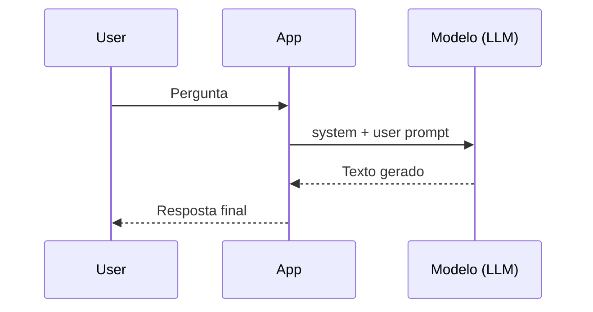
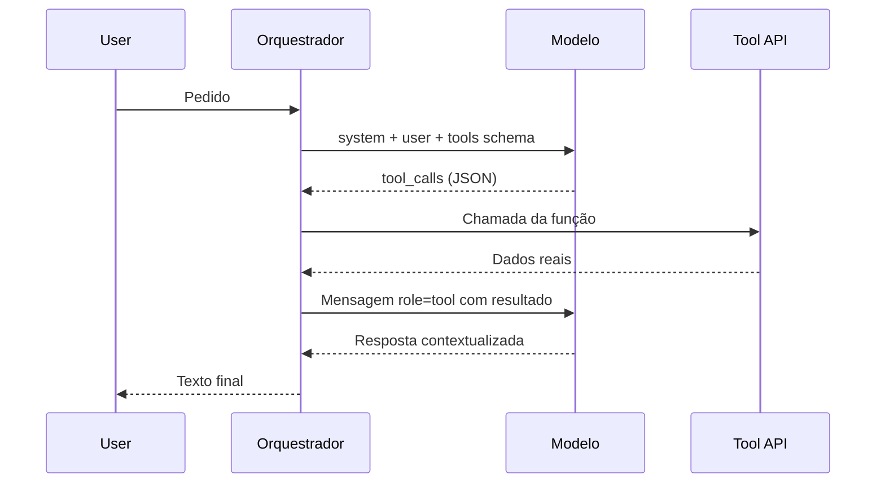
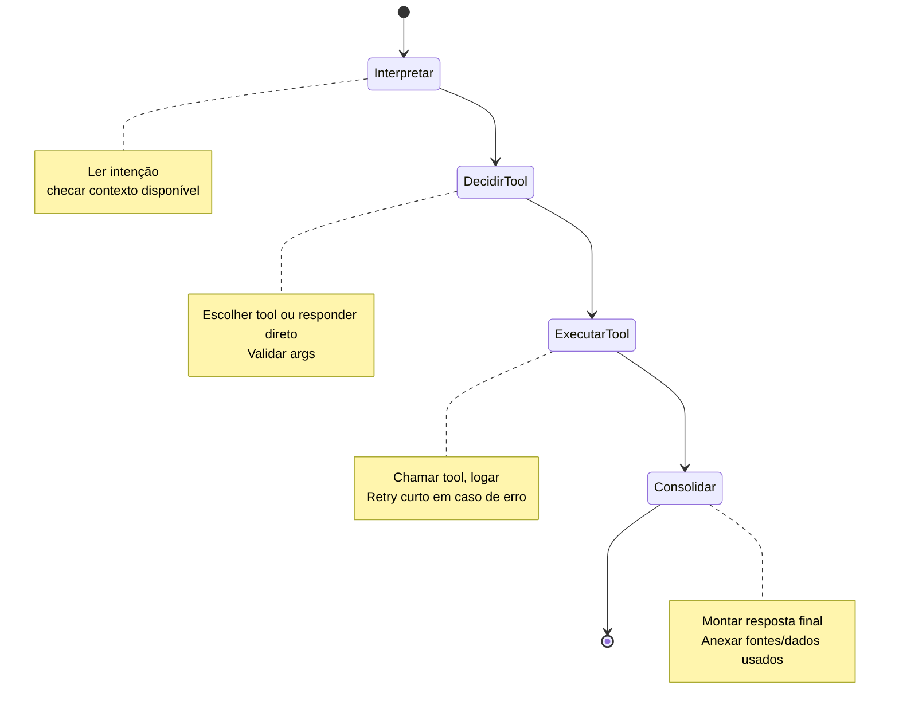

# Diagramas rápidos (Mermaid)

## Como gerar SVG/PNG

- Instale o CLI: `npm install -g @mermaid-js/mermaid-cli`
- Exemplos prontos: veja `docs/diagrams/*.svg` (já gerados).
- Renderize individualmente (ex.): `mmdc -i docs/diagrams/fluxo1-basico.mmd -o docs/diagrams/fluxo1-basico.svg -b white`
- Ou copie cada bloco para seu gerador favorito (Mermaid Live Editor).

## Fluxo 1 — Resposta generativa básica



## Fluxo 2 — Function calling / tools



## Fluxo 3 — Agent loop simples (ReAct curto)



## Fluxo 5 — Demo `demo/src/agent-mastra-gemini.ts`

```mermaid
flowchart TB
  Q[Input do usuário] --> M[Modelo (Gemini)\nmock ou API]
  M -->|tool_call| T1[get_agenda]
  M -->|tool_call| T2[get_weather]
  M -->|tool_call opcional| T3[save_note]
  T1 --> M
  T2 --> M
  T3 --> M
  M --> R[Resposta final\nPT-BR, dados das tools]
```

> Diagramas gerados: veja `docs/diagrams/fluxo1-basico.svg`, `fluxo2-tools.svg`, `fluxo3-agent-loop.svg`, `fluxo5-demo.svg`.

## GIFs de apoio (referências rápidas)

- Agent loop (ReAct curto): `docs/gifs/agent-loop.gif`
- Function calling / tools: `docs/gifs/function-calling.gif`
- MCP / integração com serviços: `docs/gifs/mcp-integration.gif`
